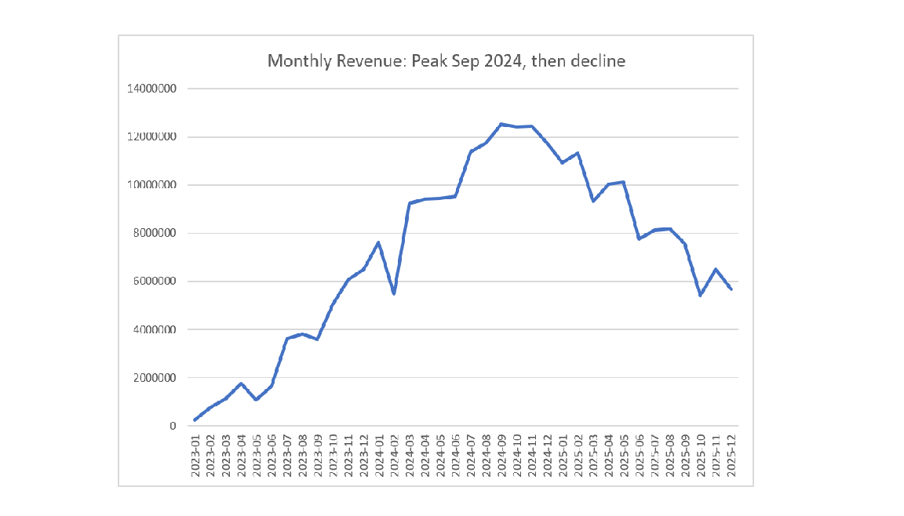
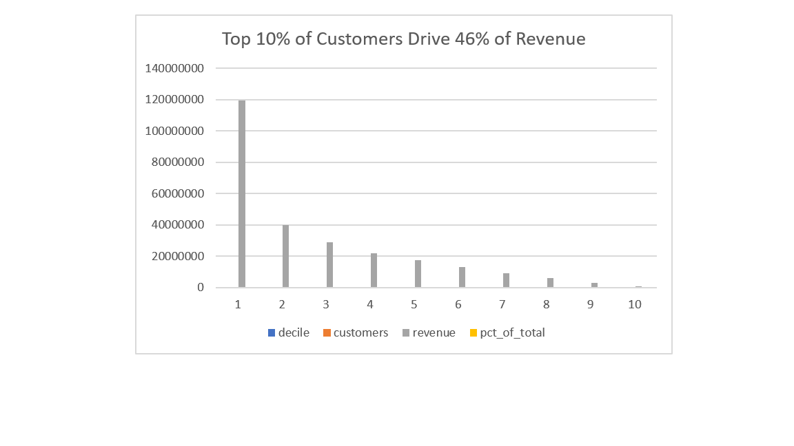
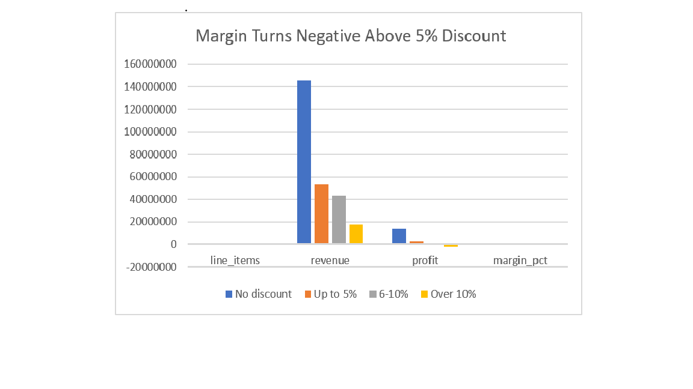

# E-Commerce Sales Analysis (SQL)

## Business question
Where does revenue come from, which customers are worth keeping,
and where is the business losing money?

## Dataset
Four related tables: 1,200 customers, 52 products, 6,735 orders,
16,876 order line items, covering Jan 2023 to Dec 2025.
Synthetic dataset built to practise the full analysis workflow.

## Tools
MySQL 8.0, Excel

## Data quality checks
- 0 orphan order items, 0 orders predating customer signup
- 9.15% of orders cancelled or returned; excluded from revenue
- 'shipped' orders (5.02%) also excluded as not yet complete

## Key findings

**1. Revenue peaked Sep 2024 (₹12.5M) and fell ~50% through 2025.**
Average order value held steady at ₹44-47K throughout, so the decline
came entirely from falling order volume, not smaller baskets.

**2. The cause was acquisition, not churn.**
No new customer signed up after Nov 2024. Retention is strong —
82% of customers placed more than one order.

**3. Revenue is highly concentrated.**
The top 10% of customers (112 people) generate 46% of revenue.
The bottom decile contributes 0.3%.

**4. Discounting past 5% destroys profit.**
Undiscounted items: 9.55% margin. 6-10% discount: -0.47%.
Above 10%: -12.62%.

**5. Technology drives 78% of revenue at only 6.32% margin.**

## Recommendations
1. Restart customer acquisition — this is the direct cause of the decline.
2. Cap discounts at 5%, testing on one category first.
3. Build retention safeguards for the top decile; losing a few of
   those 112 customers would hurt disproportionately.

## Limitations
cost_price may be COGS only rather than fully loaded cost, so true
margins may be thinner. Discount analysis assumes discounted sales
would have converted at full price, which overstates the gain.

## SQL techniques used
JOIN, GROUP BY, HAVING, CTEs, subqueries, and window functions
(LAG, RANK, NTILE, ROW_NUMBER).

## Charts

